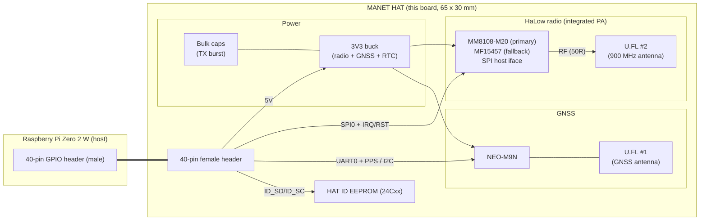

# Design Overview — Pi Zero 2 W MANET HAT

## 1. Purpose

A HAT that turns a Raspberry Pi Zero 2 W into a long-range MANET node:

- **Sub-GHz mesh data link** — Morse Micro **MM8108** Wi-Fi HaLow (IEEE 802.11ah)
  in the 902–928 MHz license-exempt band. The radio is a **high-power integrated
  module**: primary **MM8108-M20** (integrated 28.5 dBm PA + 902–928 SAW, FCC/IC
  certified), fallback **MM8108-MF15457** (~27 dBm). The earlier external E21 1 W
  PA is **retired** ([`DECISIONS.md`](DECISIONS.md) B11, [`MODULE_OPTIONS.md`](MODULE_OPTIONS.md)).
- **Position & time** — u-blox **NEO-M9N** GNSS (GPS/GLONASS/Galileo/BeiDou) with
  a **1 PPS** output for time-synchronised mesh operation.
- Powered entirely from the Pi's **40-pin header 5 V** via a single **3V3** rail —
  no PA buck-boost (the module integrates its PA).

## 2. System block diagram

## 3. Subsystems

### 3.1 HaLow radio — MM8108
- Single-chip 802.11ah MAC+PHY (5 × 5 mm BGA). Host interfaces available on the
  part are USB 2.0 / SDIO 2.0 / **SPI** — we use **SPI** because it is the only
  one of the three exposed on the Pi's 40-pin header (SDIO is consumed by the
  Pi's SD card + onboard Wi-Fi; USB is not on the header). This also matches the
  **OpenMANET** Pi Zero 2 W firmware variant, which drives the Morse radio over
  SPI — the board uses OpenMANET's exact GPIO map (CS0=GPIO8, RESET=GPIO17,
  power=GPIO23/24, IRQ=GPIO5) so the stock overlay/driver runs unchanged. See
  [`../firmware/openmanet/`](../firmware/openmanet/).
- Implemented as a **pre-certified MM8108 module** with a single 50 Ω `ANT` pin
  **after** an integrated PA — no external front-end, no FEM-control lines. The
  M20 also integrates a 902–928 SAW; both modules go straight to **U.FL #2**.
- Needs only 3.3 V supply(s), host SPI (MOSI/MISO/SCLK/CS), a host **IRQ**,
  **RESET_N**, and a **wake** line — the module integrates clock + PMU + PA.

> The **MF15457** pinout/power are fully specified (datasheet in `hardware/`) and
> are the buildable-today baseline. The **MM8108-M20** is the same MM8108 SPI stack
> with a vendor-integrated PA; its detailed pinout/power await Morse's datasheet
> (B12) and drop into the same radio site — see [`DECISIONS.md`](DECISIONS.md).

### 3.2 900 MHz RF output / antenna
- The chosen module's `ANT` (50 Ω) goes through a short matched microstrip + DC
  block to **U.FL #2**. No external PA, drive pad, or T/R control (E21 retired).
- Optional `FL2` LPF land (DNP) for MF15457 harmonic trim; the M20's integrated
  SAW makes it unnecessary. ESD clamp at the connector. See [`RF.md`](RF.md).

### 3.3 GNSS — NEO-M9N
- UART1 (module) ↔ Pi **UART0** for NMEA/UBX, **TIMEPULSE (1 PPS)** to a Pi GPIO.
- I²C (DDC) available as an alternate control bus (UART + I²C coexist; SPI mode
  would disable I²C — we keep UART+I²C). `D_SEL` left open/high = UART+I²C mode.
- RF input to **U.FL #1**; supports passive or active antenna (antenna bias
  option on the board, see [`RF.md`](RF.md)).

### 3.4 Power
- Single source: header **5 V** (pins 2 & 4). Header **3V3** is *not* used as a
  supply (the Pi's 3V3 LDO can't source the radio/GNSS load) — only as a logic
  reference + ID-EEPROM supply.
- A single **3V3** buck (through an inrush soft-start switch) feeds the radio
  module, the NEO-M9N, and the RTC, with **bulk capacitance** at the module for the
  TX burst. No PA buck-boost / `VPA` rail (the module integrates its PA).
- Full tree and budget in [`POWER.md`](POWER.md).

### 3.5 HAT identity
- 24Cxx **ID EEPROM** on **ID_SD/ID_SC** (pins 27/28) per the Raspberry Pi HAT
  spec, with write-protect, so the OS can auto-detect the board and apply the
  device-tree overlay (SPI radio, UART, PPS, etc.).

## 4. Software/OS configuration (host side)
- Enable **SPI0**, **UART0** (`enable_uart=1`, disable serial console login),
  GPIO for IRQ/RESET/PPS, and **I²C1** (if used) via the HAT EEPROM overlay or
  `config.txt`.
- **PPS** via `dtoverlay=pps-gpio,gpiopin=<PPS pin>` for chrony/gpsd time sync.
- MM8108 needs the Morse Micro Linux driver (`morse` / `morsectrl`) bound to the
  SPI device + IRQ GPIO.

See [`INTERFACES.md`](INTERFACES.md) for the exact pin map and
[`MECHANICAL.md`](MECHANICAL.md) for placement.
