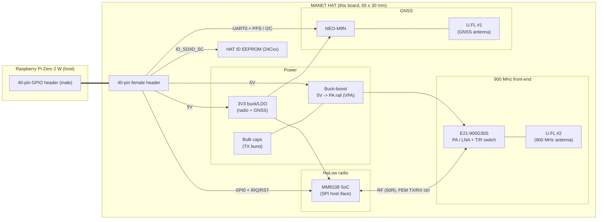

# Design Overview — Pi Zero 2 W MANET HAT

## 1. Purpose

A HAT that turns a Raspberry Pi Zero 2 W into a long-range MANET node:

- **Sub-GHz mesh data link** — Morse Micro **MM8108** Wi-Fi HaLow (IEEE 802.11ah)
  operating in the ~850–950 MHz license-exempt band, boosted by an external
  **EBYTE E21-900G30S** 1 W (30 dBm) PA + LNA front-end for multi-kilometre reach.
- **Position & time** — u-blox **NEO-M9N** GNSS (GPS/GLONASS/Galileo/BeiDou) with
  a **1 PPS** output for time-synchronised mesh operation.
- Powered entirely from the Pi's **40-pin header 5 V**; the PA gets a regulated
  rail from an onboard **buck-boost** converter.

## 2. System block diagram

## 3. Subsystems

### 3.1 HaLow radio — MM8108
- Single-chip 802.11ah MAC+PHY (5 × 5 mm BGA). Host interfaces available on the
  part are USB 2.0 / SDIO 2.0 / **SPI** — we use **SPI** because it is the only
  one of the three exposed on the Pi's 40-pin header (SDIO is consumed by the
  Pi's SD card + onboard Wi-Fi; USB is not on the header). This also matches the
  **OpenMANET** Pi Zero 2 W firmware variant, which drives the Morse radio over
  SPI — the board uses OpenMANET's exact GPIO map (CS0=GPIO8, RESET=GPIO17,
  power=GPIO23/24, IRQ=GPIO5) so the stock overlay/driver runs unchanged. See
  [`../firmware/openmanet/`](../firmware/openmanet/).
- RF port configured for an **external front-end module (FEM)** so the E21 PA/LNA
  provides the TX power and RX gain instead of the chip's internal PA. The chip's
  FEM-control outputs drive the E21 T/R switching (see [`RF.md`](RF.md)).
- Needs a reference clock (crystal/TCXO), power-sequenced supplies, host SPI
  (MOSI/MISO/SCLK/CS), a host **IRQ**, **RESET_N**, and an optional **wake** line.

> The MM8108 detailed pinout, power-sequencing and RF reference design are
> distributed by Morse Micro under NDA. This package treats the MM8108 as a
> parameterised block with named nets; the exact pin assignment must be filled in
> from the vendor reference schematic. Using a pre-certified MM8108 **module**
> that breaks out the external-FEM RF path is the lower-risk option — see
> [`DECISIONS.md`](DECISIONS.md).

### 3.2 RF front-end — E21-900G30S
- Pure-hardware PA (up to **30 dBm / 1 W**, 850–931 MHz) with built-in **LNA** and
  an integrated T/R switch.
- Control: **TXEN** and **RXEN** (3.3 V logic). TX = RXEN low / TXEN high;
  RX = RXEN high / TXEN low; both low = shutdown. These must be driven in lockstep
  with the radio's TX/RX bursts — drive them from the **MM8108 FEM-control
  outputs**, not slow Pi GPIO (timing detail in [`RF.md`](RF.md)).
- RF: transceiver-side port faces the MM8108; antenna-side port goes to **U.FL #2**.

### 3.3 GNSS — NEO-M9N
- UART1 (module) ↔ Pi **UART0** for NMEA/UBX, **TIMEPULSE (1 PPS)** to a Pi GPIO.
- I²C (DDC) available as an alternate control bus (UART + I²C coexist; SPI mode
  would disable I²C — we keep UART+I²C). `D_SEL` left open/high = UART+I²C mode.
- RF input to **U.FL #1**; supports passive or active antenna (antenna bias
  option on the board, see [`RF.md`](RF.md)).

### 3.4 Power
- Single source: header **5 V** (pins 2 & 4). Header **3V3** is *not* used as a
  supply (the Pi's 3V3 LDO can't source the radio/GNSS load) — only as a logic
  reference if needed.
- **Buck-boost** 5 V → **VPA** for the E21 (holds regulation while the USB-fed
  5 V sags during TX), plus **bulk capacitance** for the ~0.6–0.8 A TX bursts.
- A separate **3V3** buck/LDO feeds the MM8108 I/O domain and the NEO-M9N.
- Full tree and budget in [`POWER.md`](POWER.md).

### 3.5 HAT identity
- 24Cxx **ID EEPROM** on **ID_SD/ID_SC** (pins 27/28) per the Raspberry Pi HAT
  spec, with write-protect, so the OS can auto-detect the board and apply the
  device-tree overlay (SPI radio, UART, PPS, etc.).

## 4. Software/OS configuration (host side)
- Enable **SPI0**, **UART0** (`enable_uart=1`, disable serial console login),
  GPIO for IRQ/RESET/PPS, and **I²C1** (if used) via the HAT EEPROM overlay or
  `config.txt`.
- **PPS** via `dtoverlay=pps-gpio,gpiopin=<PPS pin>` for chrony/gpsd time sync.
- MM8108 needs the Morse Micro Linux driver (`morse` / `morsectrl`) bound to the
  SPI device + IRQ GPIO.

See [`INTERFACES.md`](INTERFACES.md) for the exact pin map and
[`MECHANICAL.md`](MECHANICAL.md) for placement.
